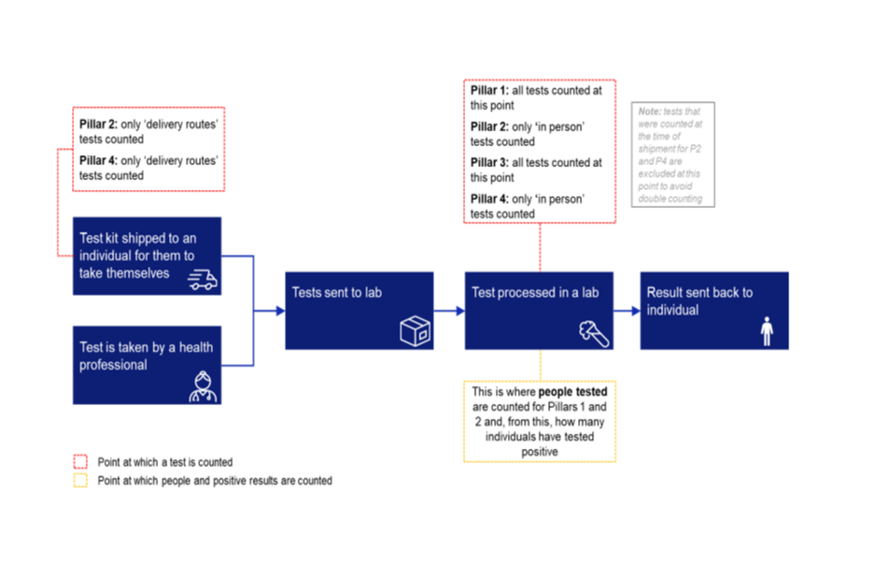
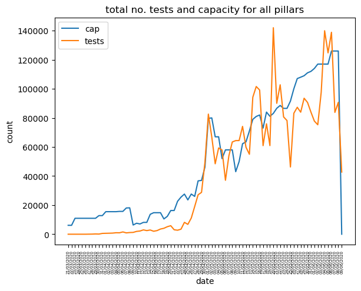
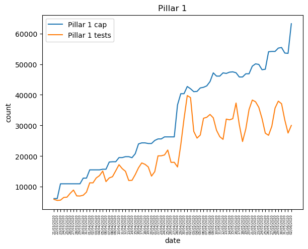
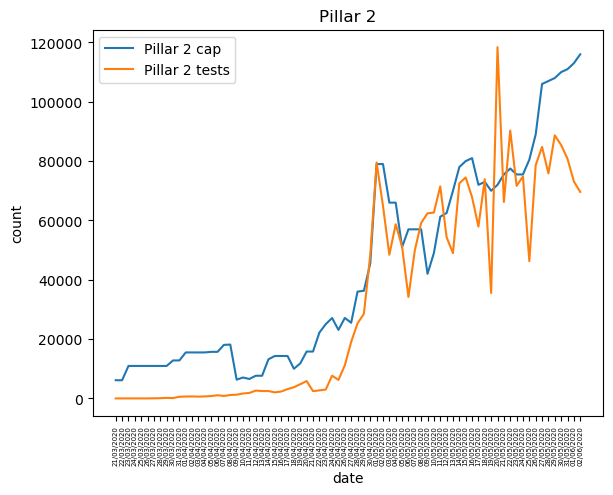
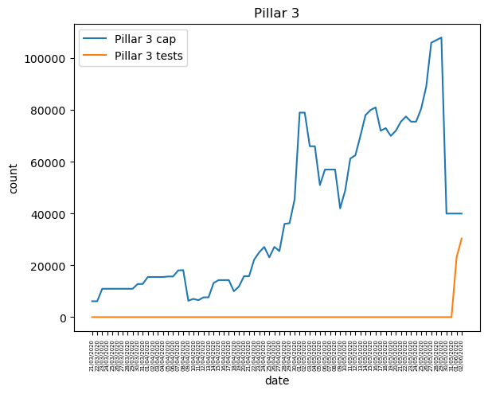
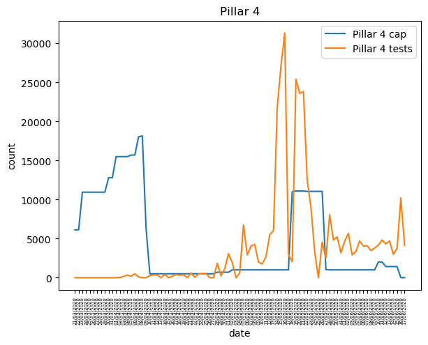

### UK COVID-19 test capacity analysis

- [methodology of how they got the data](https://www.gov.uk/government/publications/coronavirus-covid-19-testing-data-methodology/covid-19-testing-data-methodology-note)

> tests are never double counted......  some people are tested more than once

In terms of capacity:
> Daily capacity estimates are made locally by the labs themselves and fed into the Department of Health and Social Care by pillar leads.

> pillar 1 capacity – projected lab capacity for NHS, PHE and Roche labs for England and lab capacity from Devolved Administrations.

> pillar 2 capacity – projected lab capacity in the Pillar 2 network, including labs in Northern Ireland, Glasgow, Manchester, Milton Keynes and Cambridge

> pillar 3 capacity – projected current capacity to process serology tests to show if people have antibodies from having had COVID-19

> pillar 4 capacity – projected lab capacity for the Oxford University laboratory (COVID 19 infection Study, Biobank Seroprevalence Survey and an element from the care homes study), Eurofin lab capacity for Ipsos MORI swab tests

> Pillar 4 capacity fluctuates over time due to the nature of the research studies that it comprises. These research studies will run for a fixed period of time.

The given reason for the disparity and confusion is that:
> These definitions cover the capacity to process the tests outlined under ‘Tests processed through our laboratories’ and those ‘delivery’ testing routes under pillars 2 and 4 that are processed through the labs. They do not cover the count of tests despatched via ‘delivery’ testing routes under pillars 2 and 4.

So this means that there our tests for which we can't reliably measure how many we can do. But in my tired state reading this it seems that it describes pillar 2 and 4 as measurable. Then dismisses those two pillars with the same description of "'delivery' testing routes" as not possible to check capacity.

> Given the time lag and return rates for home and satellite tests, on occasion more tests are despatched than lab capacity on a given day. This could mean that the capacity number is slightly lower than total number of tests.

This makes sense although "slightly lower" and a large difference is an important factor as well.

- [data](https://www.gov.uk/guidance/coronavirus-covid-19-information-for-the-public)

Using the data provided by the government, in particular the capacity csv which hasn't been accessible until recently. We look at how the capacity has changed over time and also how that relates to individual pillars.

note: As capacity is measured in total you cannot work out the capacity of tests for London for example

The number of tests does not refer to the number of people getting tested. We only used number of people tested in April. This is because it is unclear what the relation is between the number of tests and number of people tested. Or unavailable as the government tries to sort out the reporting on it. 

NOTE: all capacity data goes up too June 8th but the graphs are reporting 

#### Results as June 9th for tests and June 8th for cap
This first graph is of all the four pillars comparing the number of tests against the capacity. 

The really interesting factor here is how much the capacity peaks, in particular how it peaked at 250,000 nearly. As well how at the start we had a lot capacity but very few tests actually being done.
---

Pillar 1: number of tests against capacity
> Pillar 1: swab testing in Public Health England (PHE) labs and NHS hospitals for those with a clinical need, and health and care workers

This is the first set of tests used. There isn't much here to comment apart from the fluxations which are most likely due to weekends... (need to check)

---
Pillar 2: number of tests against capacity
> Pillar 2: swab testing for the wider population, as set out in government guidance

This graph is a lot more exciting as there is a period there were more tests being done than there was capacity to do them. At least that it was I understand from the data as you can't store up capacity to do tests as there our so many hours in a day. In doing so it does question some of the validity of the data in how that is possible to happen in the first place.

---
Pillar 3: number of tests against capacity
>Pillar 3: serology testing to show if people have antibodies from having had COVID-19

I honestly think something must have gone wrong in how the capacity data was recorded. As clearly only after they start doing pillar 3 tests does the capacity drastically drop down.

---
Pillar 4: number of tests against capacity

> Pillar 4: serology and swab testing for national surveillance supported by PHE, ONS, Biobank, universities and other partners to learn more about the prevalence and spread of the virus and for other testing research purposes, for example on the accuracy and ease of use of home testing

Now I am just more confused than I was for pillar 3.

#### conclusion
There is some strange stuff going on with the COVID-19 testing data. I am very glad that people more experienced, smarter and wiser are looking into this:
- [Sir David Norgrove letter to health secretary](https://www.statisticsauthority.gov.uk/correspondence/sir-david-norgrove-letter-to-matt-hancock-regarding-covid-19-testing/)
- [Sir David Norgrove letter to health secretary](https://www.statisticsauthority.gov.uk/correspondence/sir-david-norgrove-response-to-matt-hancock-regarding-the-governments-covid-19-testing-data/)
- [Financial Times looking into the excess mortality data](https://github.com/Financial-Times/coronavirus-excess-mortality-data)
    - (note: soon after we weren't doing as well as other countries by number of days we did move to 'stay alert' and stopped showing the comparison to other countries in the slides)
- [Guardian Article giving an overview up until the end of March of the government response](https://www.theguardian.com/world/2020/apr/29/revealed-the-inside-story-of-uk-covid-19-coronavirus-crisis)

Although now the government are providing more data it doesn't add up. Mistakes do happen but when data is being used to inform government on policy and the general public on what's safe its crucial that it is accurate. The government have had time to deal with these kind of issues but is still lagging behind.

#### Further things to look into graphing maybe

- For pillar 2 and 4 we can look at the breakdown of delivery against in-person tests.
- number of people tested although this has already been done by others in detail